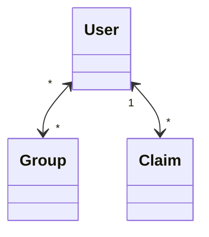

# EntityFramework core migration 示範

## 操作過程
1. 建立專案
```shell
dotnet new webapi -o EfCoreMigrationDemo
```
2. 加入 EntityFramework core 相關lib
```shell
dotnet add package Microsoft.EntityFrameworkCore.Design
# 如果是 MS SQL Server
dotnet add package Microsoft.EntityFrameworkCore.SqlServer
# 如果是 PostgreSQL
dotnet add package Npgsql.EntityFrameworkCore.PostgreSQL
```
3. 加入初次的資料表定義

Person.cs
```csharp
public class Person
{
    public Guid Id { get; set; }

    public string Name { get; set; } = null!;
}
```

AppDbContext.cs
```csharp
using Microsoft.EntityFrameworkCore;

public class AppDbContext : DbContext
{
    public virtual DbSet<Person> People { get; set; } = null!;

    protected override void OnModelCreating(ModelBuilder modelBuilder)
    {
        modelBuilder.Entity<Person>(entity =>
        {
            entity.Property(e => e.Id)
                .ValueGeneratedNever()
                .HasComment("ID");

            entity.Property(e => e.Name)
                .HasComment("姓名");
        });
    }
}
```
4. 加入資料庫遷移
```csharp
public class AppDbContext : DbContext
{
    public AppDbContext(DbContextOptions<AppDbContext> options)
            : base(options)
    {
    }
    //省略
}
```

Program.cs
```csharp
//省略
//簡單註冊DbContext
builder.Services.AddDbContext<AppDbContext>(b => b.UseSqlServer(configuration.GetConnectionString("DefaultConnection")));
//繞過需要 ConnectionString
builder.Services.AddDbContext<AppDbContext>(b =>
{
    var connectionString = configuration.GetConnectionString("DefaultConnection");
    if (string.IsNullOrWhiteSpace(connectionString))
        b.UseSqlServer();
    else
        b.UseSqlServer(connectionString);
});
//省略
```
[更正規做法參考](https://docs.microsoft.com/en-us/ef/core/cli/dbcontext-creation?tabs=dotnet-core-cli#from-a-design-time-factory)

appsettings.json
```json
{
  "ConnectionStrings": {
    "DefaultConnection": "<按狀況填寫>"
  }
}
```

```shell
#dotnet ef migrations add <本次異動名稱>
dotnet ef migrations add Init
dotnet ef migrations script -o oupput.sql
```

5. 異動資料表定義



Person.cs
```csharp
public class Person
{
    public Person()
    {
        Groups = new HashSet<Group>();
        Claims = new HashSet<Claim>();
    }

    public Guid Id { get; set; }

    //異動欄位名稱
    public string NickName { get; set; } = null!;

    //新增欄位
    public string Email { get; set; } = null!;

    //新增多群組
    public virtual ICollection<Group> Groups { get; set; }

    //新增多宣稱
    public virtual ICollection<Claim> Claims { get; set; }
}
```

Group.cs
```csharp
public class Group
{
    public Group()
    {
        People = new HashSet<Person>();
    }

    public Guid Id { get; set; }

    public string Name { get; set; } = null!;

    public virtual ICollection<Person> People { get; set; }
}
```

Claim.cs
```csharp
public class Claim
{
    public Guid Id { get; set; }

    public Guid PersonId { get; set; }

    public string Type { get; set; } = null!;

    public string Value { get; set; } = null!;

    public virtual Person Person { get; set; } = null!;
}
```

AppDbContext.cs
```csharp
public class AppDbContext : DbContext
{
    //省略
    public virtual DbSet<Group> Groups { get; set; } = null!;

    public virtual DbSet<Claim> Claims { get; set; } = null!;

    protected override void OnModelCreating(ModelBuilder modelBuilder)
    {
        modelBuilder.Entity<Person>(entity =>
        {
            entity.Property(e => e.Id)
                .ValueGeneratedNever()
                .HasComment("ID");

            //異動
            entity.Property(e => e.NickName)
                .HasComment("暱稱");

            //新增
            entity.Property(e => e.Email)
                .HasComment("信箱");

            //新增多對多關係
            entity.HasMany(e => e.Groups)
                .WithMany(e => e.People)
                .UsingEntity<PersonGroup>(c =>
                {
                    c.Property(c => c.PersonId)
                        .HasComment("人員ID");

                    c.Property(c => c.GroupId)
                        .HasComment("群組ID");

                    c.HasOne(e => e.Person)
                        .WithMany()
                        .HasForeignKey(e => e.PersonId)
                        .OnDelete(DeleteBehavior.Cascade);

                    c.HasOne(e => e.Group)
                        .WithMany()
                        .HasForeignKey(e => e.GroupId)
                        .OnDelete(DeleteBehavior.Cascade);
                });
        });

        //新增
        modelBuilder.Entity<Group>(entity =>
        {
            entity.Property(e => e.Id)
                .ValueGeneratedNever()
                .HasComment("ID");

            entity.Property(e => e.Name)
                .HasComment("名稱");
        });

        //新增
        modelBuilder.Entity<Claim>(entity =>
        {
            entity.Property(e => e.Id)
                .ValueGeneratedNever()
                .HasComment("ID");

            entity.Property(e => e.Type)
                .HasComment("類型");

            entity.Property(e => e.Value)
                .HasComment("值");
            
            //新增多對一關係
            entity.HasOne(e => e.Person)
                .WithMany(e => e.Claims)
                .HasForeignKey(e => e.PersonId)
                .OnDelete(DeleteBehavior.Cascade);
        });
    }
}
```

5. 更新資料庫遷移

```shell
#dotnet ef migrations add <本次異動名稱>
dotnet ef migrations add AddGroupAndClaim
```

修正遷移描述
```csharp
protected override void Up(MigrationBuilder migrationBuilder)
        {
            migrationBuilder.RenameColumn(
                name: "Name",
                table: "People",
                newName: "NickName"
            );

            migrationBuilder.Sql(@"DECLARE @v sql_variant 
SET @v = N'暱稱'
EXECUTE sp_updateextendedproperty N'MS_Description', @v, N'SCHEMA', N'dbo', N'TABLE', N'People', N'COLUMN', N'NickName'
GO");
        }

protected override void Down(MigrationBuilder migrationBuilder)
        {
            migrationBuilder.Sql(@"DECLARE @v sql_variant 
SET @v = N'姓名'
EXECUTE sp_updateextendedproperty N'MS_Description', @v, N'SCHEMA', N'dbo', N'TABLE', N'People', N'COLUMN', N'NickName'
GO");

            migrationBuilder.RenameColumn(
                name: "NickName",
                table: "People",
                newName: "Name"
            );
        }
```

```shell
#dotnet ef migrations script [起點版本 = 0] [目標版本 = last]
dotnet ef migrations script Init -o output.sql
```